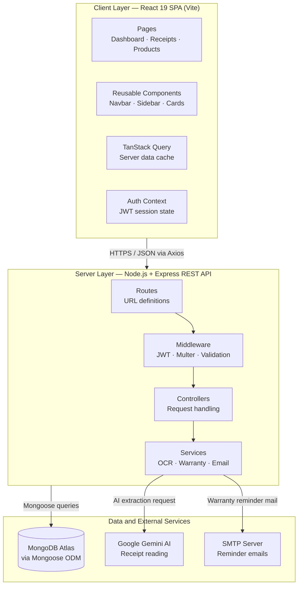
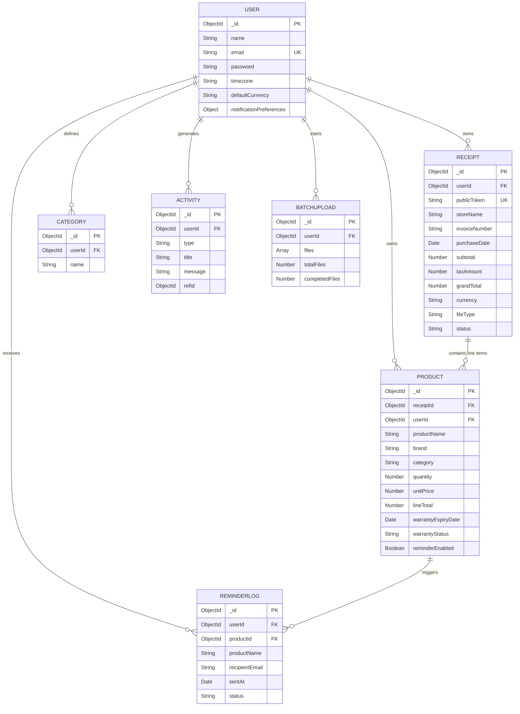
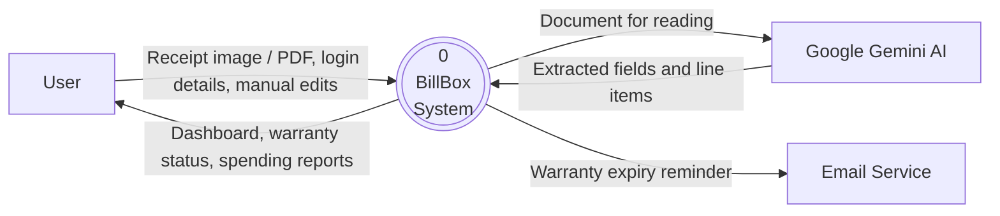
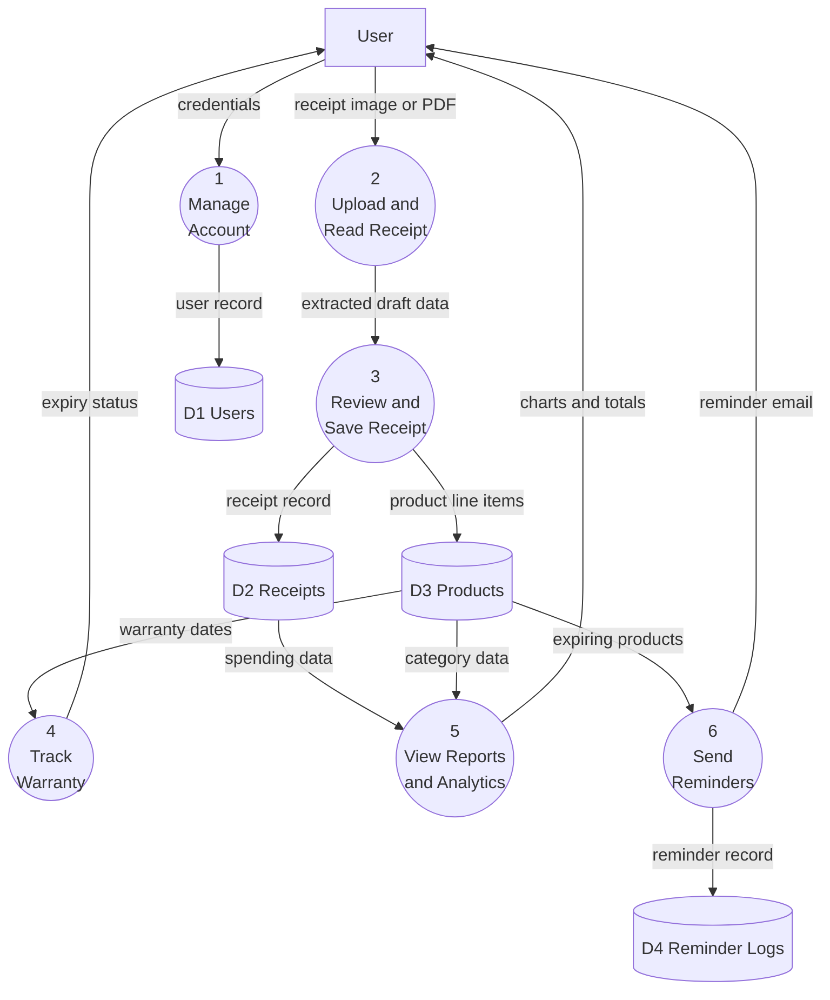
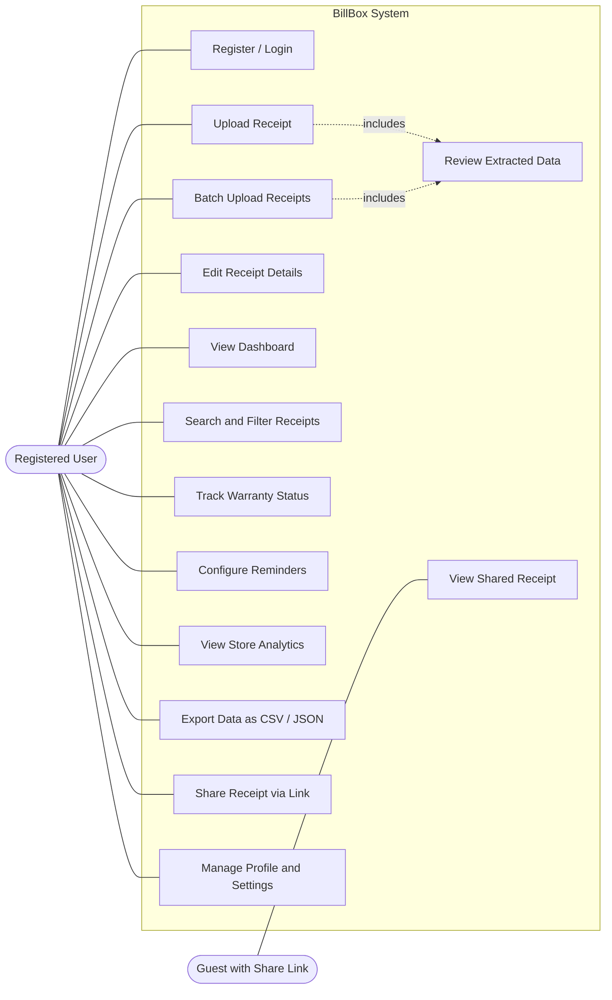
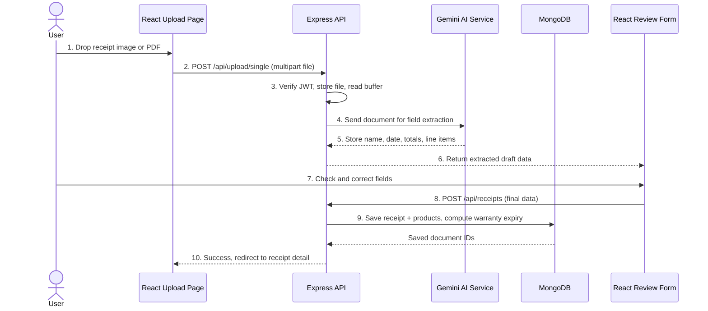
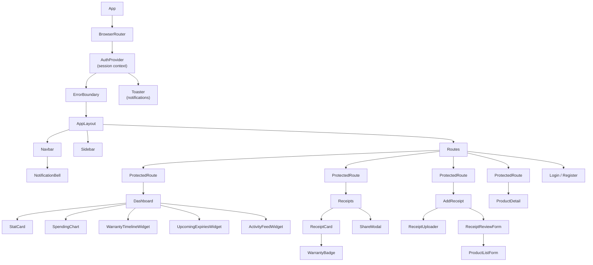
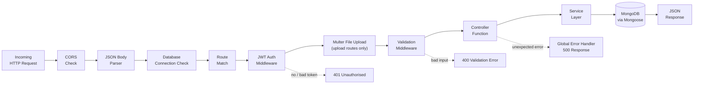
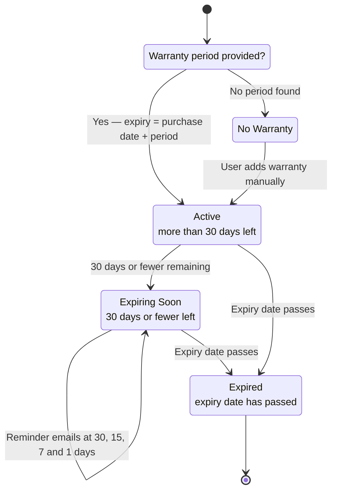
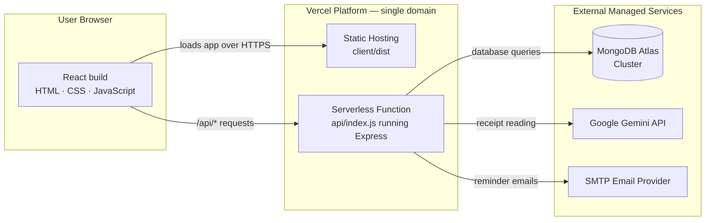

# BillBox — Diagram Prompts

Ten diagrams are referenced in the project report. For each one you get **two options**:

- **Option A — AI image prompt.** Paste into Gemini / ChatGPT image generation. Fast, but AI image tools often misspell labels in diagrams, so always zoom in and check the text before pasting into the report.
- **Option B — Mermaid code (recommended).** Paste into <https://mermaid.live>, then use *Actions → PNG* to download a clean, pixel-sharp diagram with correct spelling. This is the safer choice for a submission.

Keep every diagram on a **white background** so it sits cleanly in the Word document. Export at a wide size (at least 1600 px) so it stays sharp when printed.

Figure numbers below match the placeholders already in the report.

---

## 1. System Architecture — Figure 1

**Option A — AI image prompt**

> Create a clean, professional three-tier software architecture diagram on a pure white background, in a flat modern style with rounded rectangles, thin grey connector lines and a navy blue and light blue colour scheme. No shadows, no 3D, no clipart.
>
> Layer 1, labelled "Client Layer": a single box "React 19 Single Page Application (Vite)" containing four small stacked boxes: "Pages", "Components", "TanStack Query Cache", "Auth Context".
>
> Layer 2, labelled "Server Layer": a single box "Node.js + Express REST API" containing four small stacked boxes: "Routes", "Controllers", "Services", "Middleware (JWT, Multer, Validation)".
>
> Layer 3, labelled "Data and External Services": three separate boxes side by side: "MongoDB Atlas (Mongoose ODM)", "Google Gemini AI (Receipt Reading)", "SMTP Email Service".
>
> Draw a labelled arrow from Layer 1 to Layer 2 reading "HTTPS / JSON via Axios", and three labelled arrows from Layer 2 down to each of the three Layer 3 boxes, reading "Mongoose queries", "AI extraction request" and "Reminder emails". Use clear, readable sans-serif text.

**Option B — Mermaid code**

---

## 2. Entity Relationship Diagram — Figure 2

**Option A — AI image prompt**

> Create a clean database entity relationship diagram on a white background in flat professional style. Seven entity boxes, each with a navy header bar containing the entity name in white text and a white body listing its key fields in grey sans-serif text.
>
> Entities and fields: "User (name, email, password, timezone, defaultCurrency, notificationPreferences)"; "Receipt (userId, publicToken, storeName, invoiceNumber, purchaseDate, subtotal, taxAmount, grandTotal, currency, fileType, status)"; "Product (receiptId, userId, productName, brand, category, quantity, unitPrice, lineTotal, warrantyExpiryDate, warrantyStatus, reminderEnabled)"; "Category (userId, name)"; "Activity (userId, type, title, message, refId)"; "BatchUpload (userId, files, totalFiles, completedFiles)"; "ReminderLog (userId, productId, productName, recipientEmail, sentAt, status)".
>
> Draw crow's foot relationship lines: User to Receipt labelled "1 to many", Receipt to Product labelled "1 to many", User to Product labelled "1 to many", User to Category labelled "1 to many", User to Activity labelled "1 to many", User to BatchUpload labelled "1 to many", Product to ReminderLog labelled "1 to many". Place User on the left as the central parent entity.

**Option B — Mermaid code**

---

## 3. Data Flow Diagram — Level 0 (Context) — Figure 3

**Option A — AI image prompt**

> Create a simple Level 0 context data flow diagram on a white background, flat professional style. One large navy circle in the centre labelled "0 — BillBox System". On the left, a grey rectangle labelled "User". On the right, two grey rectangles labelled "Google Gemini AI" and "Email Service".
>
> Draw labelled arrows: from User to the circle reading "Receipt image / PDF, login details, edits"; from the circle to User reading "Dashboard, warranty status, spending reports"; from the circle to Google Gemini AI reading "Document for reading"; from Gemini back to the circle reading "Extracted fields and line items"; from the circle to Email Service reading "Warranty expiry reminder". Use readable sans-serif labels.

**Option B — Mermaid code**

---

## 4. Data Flow Diagram — Level 1 — Figure 4

**Option A — AI image prompt**

> Create a Level 1 data flow diagram on a white background in flat professional style. Use navy circles for processes, grey rectangles for external entities, and open-ended grey bars for data stores.
>
> External entity on the left: "User". Processes as numbered circles: "1 Manage Account", "2 Upload and Read Receipt", "3 Review and Save Receipt", "4 Track Warranty", "5 View Reports and Analytics", "6 Send Reminders". Data stores as open bars: "D1 Users", "D2 Receipts", "D3 Products", "D4 Reminder Logs".
>
> Connect with labelled arrows: User to process 1 "credentials"; process 1 to D1 "user record"; User to process 2 "receipt file"; process 2 to process 3 "extracted draft data"; process 3 to D2 "receipt record" and to D3 "product line items"; D3 to process 4 "warranty dates"; process 4 to User "expiry status"; D2 and D3 to process 5 "spending data"; process 5 to User "charts and totals"; D3 to process 6 "expiring products"; process 6 to D4 "reminder log"; process 6 to User "reminder email".

**Option B — Mermaid code**

---

## 5. Use Case Diagram — Figure 5

**Option A — AI image prompt**

> Create a UML use case diagram on a white background in flat professional style. A stick figure labelled "Registered User" on the left and a stick figure labelled "Guest with Share Link" on the bottom left. A large rounded rectangle boundary box labelled "BillBox" containing light blue ovals.
>
> Ovals: "Register / Login", "Upload Receipt", "Batch Upload Receipts", "Review Extracted Data", "Edit Receipt Details", "View Dashboard", "Search and Filter Receipts", "Track Warranty Status", "Configure Reminders", "View Store Analytics", "Export Data as CSV / JSON", "Share Receipt via Link", "Manage Profile and Settings", "View Shared Receipt".
>
> Connect "Registered User" with solid lines to every oval except "View Shared Receipt". Connect "Guest with Share Link" with a solid line only to "View Shared Receipt". Add a dashed arrow labelled "includes" from "Upload Receipt" to "Review Extracted Data".

**Option B — Mermaid code**

---

## 6. Receipt Upload Sequence Diagram — Figure 6

**Option A — AI image prompt**

> Create a UML sequence diagram on a white background in clean flat professional style. Six vertical lifelines with labelled boxes at the top: "User", "React Upload Page", "Express API", "Gemini AI Service", "MongoDB", "React Review Form". Draw horizontal arrows between lifelines in time order, numbered 1 to 10, with short readable labels.
>
> Order of messages: 1 User drops receipt file on React Upload Page; 2 React Upload Page sends POST /api/upload/single with the file to Express API; 3 Express API verifies the JWT token and saves the file temporarily; 4 Express API sends the document to Gemini AI Service; 5 Gemini AI Service returns store name, date, totals and line items; 6 Express API returns the extracted draft to React Review Form; 7 User checks and corrects the fields; 8 React Review Form sends POST /api/receipts to Express API; 9 Express API writes the receipt and its product line items to MongoDB, calculating warranty expiry dates; 10 Express API confirms saved and React redirects to the receipt detail page. Use a dashed line style for return messages.

**Option B — Mermaid code**

---

## 7. React Component Hierarchy — Figure 7

**Option A — AI image prompt**

> Create a clean top-down component tree diagram on a white background, flat professional style with rounded rectangles in light blue and thin grey connector lines, arranged as a hierarchy.
>
> Root: "App". Below App: "BrowserRouter", "AuthProvider", "ErrorBoundary", "Toaster". Below those: "AppLayout". Below AppLayout, three children: "Navbar", "Sidebar", "Routes". Below Navbar: "NotificationBell". Below Routes, a row of page boxes: "Dashboard", "Receipts", "AddReceipt", "ProductDetail", "Settings", each wrapped in a small box labelled "ProtectedRoute". Below Dashboard: "StatCard", "SpendingChart", "WarrantyTimelineWidget", "UpcomingExpiriesWidget", "ActivityFeedWidget". Below Receipts: "ReceiptCard", "WarrantyBadge", "ShareModal". Below AddReceipt: "ReceiptUploader", "ReceiptReviewForm", "ProductListForm". Label the diagram "React Component Hierarchy".

**Option B — Mermaid code**

---

## 8. Express Request Pipeline — Figure 8

**Option A — AI image prompt**

> Create a clean left-to-right horizontal pipeline diagram on a white background, flat professional style, using navy rounded rectangles connected by grey arrows, like a processing conveyor.
>
> Boxes in order: "Incoming HTTP Request", "CORS Check", "JSON Body Parser", "Database Connection Check", "Route Match", "JWT Auth Middleware", "Multer File Upload (upload routes only)", "Validation Middleware", "Controller Function", "Service Layer", "MongoDB via Mongoose", "JSON Response".
>
> Add a separate branch arrow from "JWT Auth Middleware" pointing down to a red-outlined box labelled "401 Unauthorised Response", and another from "Validation Middleware" down to a red-outlined box labelled "400 Validation Error Response". At the far right add a box labelled "Global Error Handler" with a dashed arrow into it from the controller box.

**Option B — Mermaid code**

---

## 9. Warranty Lifecycle State Diagram — Figure 9

**Option A — AI image prompt**

> Create a UML state machine diagram on a white background in flat professional style, with rounded state boxes and labelled transition arrows. Use a green box for "Active", an amber box for "Expiring Soon", a red box for "Expired" and a grey box for "No Warranty".
>
> A solid black start dot points to a decision point labelled "Warranty period provided?". A "No" arrow goes to the grey "No Warranty" state. A "Yes" arrow goes to the green "Active" state, with a note reading "expiry = purchase date + warranty period".
>
> From "Active" an arrow labelled "30 days or fewer remaining" goes to amber "Expiring Soon". From "Expiring Soon" an arrow labelled "expiry date passes" goes to red "Expired". From "Expiring Soon" an arrow labelled "reminder emails sent at 30, 15, 7 and 1 days" loops back onto itself. From "Expired" an arrow points to a black and white end dot. Add an arrow from "No Warranty" to "Active" labelled "user adds warranty manually".

**Option B — Mermaid code**

---

## 10. Deployment Diagram — Figure 10

**Option A — AI image prompt**

> Create a clean cloud deployment diagram on a white background in flat professional style with rounded boxes, light blue and navy colours, and thin grey arrows.
>
> On the left, a box labelled "User Browser" containing "React build (HTML, CSS, JavaScript)". In the centre, a large rounded boundary box labelled "Vercel Platform" containing two boxes: "Static Hosting — client/dist" and "Serverless Function — api/index.js running Express". On the right, three separate cloud-shaped boxes: "MongoDB Atlas Cluster", "Google Gemini API", "SMTP Email Provider".
>
> Draw labelled arrows: User Browser to Static Hosting reading "loads app over HTTPS"; User Browser to Serverless Function reading "/api/* requests"; Serverless Function to MongoDB Atlas reading "database queries"; Serverless Function to Google Gemini API reading "receipt reading"; Serverless Function to SMTP Email Provider reading "reminder emails". Add a small note box reading "Single domain — rewrites in vercel.json route /api/* to the serverless function".

**Option B — Mermaid code**

---

## How to insert a diagram into the report

1. Generate the diagram and save it as a PNG.
2. Open `BillBox_Project_Report.docx` and find the matching grey placeholder box (for example *"Figure 1 — System Architecture"*).
3. Click inside the placeholder box, delete the instruction line, then go to **Insert → Pictures** and choose your PNG.
4. With the image selected, set **Wrap Text → In Line with Text** and drag a corner handle until the image fits the page width.
5. Leave the caption line underneath exactly as it is, so figure numbering stays consistent.
