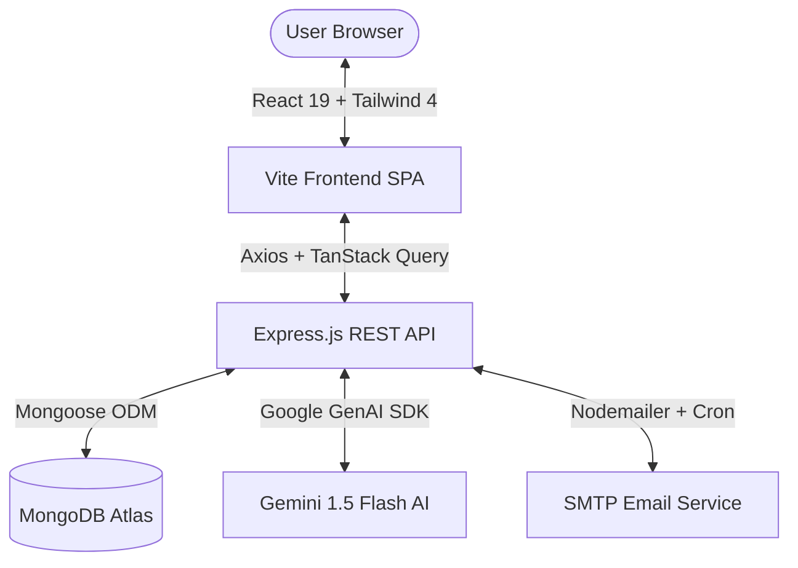

<div align="center">

# 📦 BillBox
### **Smart Digital Invoice, Receipt & Warranty Lifecycle Manager**

*Effortlessly scan invoices, track active warranties, analyze store spending, and convert currencies in real time.*

---

[](https://nodejs.org)
[](https://react.dev)
[](https://vitejs.dev)
[](https://tailwindcss.com)
[](https://expressjs.com)
[](https://www.mongodb.com)
[](https://ai.google.dev)
[](https://vercel.com)

</div>

---

## 📖 Table of Contents
- [Executive Overview](#-executive-overview)
- [Key Features](#-key-features)
- [Architecture & Tech Stack](#-architecture--tech-stack)
- [Project Structure](#-project-structure)
- [Getting Started](#-getting-started)
  - [Prerequisites](#prerequisites)
  - [Step 1: Clone Repository](#step-1-clone-repository)
  - [Step 2: Backend Configuration](#step-2-backend-configuration)
  - [Step 3: Frontend Configuration](#step-3-frontend-configuration)
  - [Step 4: Run Development Servers](#step-4-run-development-servers)
- [Environment Variables](#-environment-variables)
- [REST API Reference](#-rest-api-reference)
- [Deployment Guide](#-deployment-guide)
  - [1-Click Fullstack Vercel Deployment](#1-click-fullstack-vercel-deployment)
  - [Alternative Split Deployment (Vercel + Render)](#alternative-split-deployment-vercel--render)
- [License](#-license)

---

## 🌟 Executive Overview

**BillBox** is a full-stack digital receipt and warranty lifecycle tracking platform designed to eliminate lost paper receipts and expired warranty claims. By pairing **Google Gemini AI** and **Tesseract.js OCR** with a high-performance **React 19 & Express.js** architecture, BillBox transforms physical paper bills and digital PDF invoices into searchable structured assets.

---

## ✨ Key Features

### ⚡ 1. AI-Assisted OCR & Receipt Extraction
- **Multimodal Intelligence:** Upload receipt images (`.jpg`, `.png`, `.webp`) or digital PDF invoices (`.pdf`).
- **Deep Metadata Extraction:** Automatically parses Vendor/Store Name, Purchase Date, Invoice Numbers, Tax, Discounts, and Individual Line Items.
- **Smart Category Tagging:** Identifies and classifies items into Electronics, Home & Kitchen, Fashion, Groceries, Appliances, and more.

### 🛡️ 2. Warranty Lifecycle & Expiry Tracker
- **Warranty Countdown:** Live calculation of days remaining until expiration.
- **Visual Horizon Progress:** Color-coded milestones:
  - 🔴 **Critical:** &le; 30 days remaining
  - 🟠 **Attention:** 30 – 90 days remaining
  - 🟡 **Moderate:** 90 – 180 days remaining
  - 🟢 **Safe:** > 180 days remaining
- **Automated Email Reminders:** Scheduled daily cron alerts (via Nodemailer) notifying users before warranties expire (e.g. 45, 30, 15, or 7 days in advance).

### 💱 3. Real-Time Mathematical Currency Engine
- **Global Currency Support:** Automatically converts amounts between `USD ($)`, `EUR (€)`, `GBP (£)`, `CAD (CA$)`, `AUD (AU$)`, `JPY (¥)`, and `INR (₹)`.
- **True Mathematical Recalculation:** Accurately converts aggregate metrics (Lifetime Spend, Monthly Spend, Store Averages) using live mid-market exchange rates.

### 🔍 4. Modern Top-Dropping Search & Filter System
- **Compact Search Trigger:** Clean, space-efficient button opening a wide, smooth-dropping filter modal from the top of the screen.
- **Instant Keyword Search:** Real-time search across product names, brands, store names, and invoice numbers.
- **Interactive Active Filter Chips:** 1-click removal of active keyword tags and category filters.

### 📊 5. Merchant & Spending Intelligence
- **Store Spending Insights:** Track total spend, average bill size, and transaction frequency per store.
- **Category Spending Bars:** Clean visual progress indicators showing expense distribution.
- **Spending Trends:** Interactive charts and breakdown of monthly purchase history.

### 📄 6. Data Portability & Sharing
- **1-Click CSV / JSON Export:** Download all structured receipts, itemized rows, and warranty data anytime.
- **Encrypted Public Sharing:** Generate secure, read-only tokenized links (`/public/r/:token`) for expense reimbursements or warranty claims.
- **Danger Zone Controls:** Protected data reset mechanism requiring double confirmation (`DELETE`).

---

## 🛠 Architecture & Tech Stack



### Frontend
- **Framework:** React 19 + Vite 6
- **Styling:** Tailwind CSS 4 (Tailored design tokens, Glassmorphism, Micro-animations)
- **State & Data Fetching:** TanStack React Query 5 & Zustand 4
- **Routing:** React Router DOM 6
- **Icons & UI Feedback:** Lucide React & React Hot Toast

### Backend
- **Runtime:** Node.js (v20+)
- **Server Framework:** Express.js 4.21
- **Database & ODM:** MongoDB & Mongoose 8.9
- **Authentication:** JSON Web Tokens (JWT) & bcryptjs password hashing
- **File Processing & OCR:** Google Gemini 1.5 Flash API, Tesseract.js, Sharp, PDF-Parse, Multer
- **Scheduled Tasks:** Node-Cron daily reminder scheduler

---

## 📂 Project Structure

```
BillBox/
├── api/                     # Vercel Serverless Function entrypoint
│   └── index.js             # Serverless Express handler with cached DB connection
├── client/                  # Frontend Vite + React application
│   ├── public/              # Static assets (Favicon, _redirects)
│   ├── src/
│   │   ├── api/             # Axios instance & interceptors
│   │   ├── components/      # Modular UI components (Navbar, Sidebar, Widgets)
│   │   ├── context/         # AuthContext & global providers
│   │   ├── hooks/           # Custom React hooks (useAuth, useReceipts)
│   │   ├── pages/           # Application views (Dashboard, Receipts, Products, Settings)
│   │   ├── queries/         # TanStack Query hooks & mutations
│   │   ├── store/           # Zustand state management stores
│   │   └── utils/           # Formatters (Currency math, dates)
│   ├── index.html           # HTML entry point with BillBox branding
│   ├── package.json
│   ├── vercel.json          # Client-side SPA routing config
│   └── vite.config.js
├── server/                  # Backend Express application
│   ├── config/              # MongoDB connection & Cloudinary/File config
│   ├── controllers/         # Route controllers (Auth, Receipts, Products, Stores)
│   ├── middleware/          # JWT auth & express-validator middleware
│   ├── models/              # Mongoose schemas (User, Receipt, Product, ReminderLog)
│   ├── routes/              # Express API route declarations
│   ├── services/            # Business logic (Gemini OCR, Reminders, Activity)
│   ├── utils/               # Response handlers & helpers
│   ├── .env.example         # Template environment variables
│   ├── package.json
│   └── server.js            # Express server initialization
├── vercel.json              # Fullstack root Vercel configuration
├── package.json             # Root monorepo build & run scripts
└── README.md                # Project documentation
```

---

## 🚀 Getting Started

### Prerequisites
- **Node.js**: `v20.x` or higher installed ([Download Node.js](https://nodejs.org))
- **MongoDB**: A free **MongoDB Atlas** cluster or a local MongoDB instance running on port `27017`.
- **Google Gemini API Key**: Free key from [Google AI Studio](https://aistudio.google.com).

---

### Step 1: Clone Repository
```bash
git clone https://github.com/your-username/BillBox.git
cd BillBox
```

---

### Step 2: Backend Configuration
Navigate to the `server/` directory and install dependencies:
```bash
cd server
npm install
```

Create your `.env` file from the provided example:
```bash
cp .env.example .env
```

Open `server/.env` and fill in your values:
```env
PORT=5000
MONGODB_URI=mongodb+srv://<username>:<password>@cluster0.xxxxx.mongodb.net/billbox?retryWrites=true&w=majority
JWT_SECRET=your_super_secret_jwt_key_2026
JWT_EXPIRES_IN=7d
CLIENT_URL=http://localhost:5173
GEMINI_API_KEY=your_google_gemini_api_key
```

---

### Step 3: Frontend Configuration
Navigate to the `client/` directory and install dependencies:
```bash
cd ../client
npm install
```

Create your `.env` file:
```bash
cp .env.example .env
```

Configure `client/.env`:
```env
VITE_API_BASE_URL=http://localhost:5000/api
```

---

### Step 4: Run Development Servers

**Option A: Run from Root (Simultaneous)**
```bash
# In the project root directory
npm run dev:server    # Terminal 1: Starts Backend on http://localhost:5000
npm run dev:client    # Terminal 2: Starts Frontend on http://localhost:5173
```

**Option B: Run Individually**
```bash
# Terminal 1 (Backend)
cd server
npm run dev

# Terminal 2 (Frontend)
cd client
npm run dev
```

Open **`http://localhost:5173`** in your browser.

---

## 🔐 Environment Variables

### Backend (`server/.env`)
| Variable | Required | Default | Description |
| :--- | :---: | :---: | :--- |
| `PORT` | No | `5000` | Express server port |
| `MONGODB_URI` | **Yes** | — | MongoDB Atlas or local connection string |
| `JWT_SECRET` | **Yes** | — | Secret string used to sign JSON Web Tokens |
| `JWT_EXPIRES_IN` | No | `7d` | Expiration duration for user sessions |
| `CLIENT_URL` | No | `http://localhost:5173` | Allowed CORS frontend origin |
| `GEMINI_API_KEY` | **Yes** | — | Google Gemini API key for OCR processing |
| `SMTP_HOST` | No | `smtp.brevo.com` | SMTP host for reminder emails |
| `SMTP_PORT` | No | `587` | SMTP port |
| `SMTP_USER` | No | — | SMTP account username |
| `SMTP_PASS` | No | — | SMTP account password |
| `EMAIL_FROM` | No | `noreply@billbox.com` | Outgoing sender email address |

### Frontend (`client/.env`)
| Variable | Required | Default | Description |
| :--- | :---: | :---: | :--- |
| `VITE_API_BASE_URL` | No | `http://localhost:5000/api` | Backend API base URL |

---

## 📡 REST API Reference

### Authentication & Profile (`/api/auth`)
| Method | Endpoint | Description | Auth Required |
| :--- | :--- | :--- | :---: |
| `POST` | `/api/auth/register` | Register a new user account | No |
| `POST` | `/api/auth/login` | Login user & return JWT token | No |
| `GET` | `/api/auth/me` | Fetch active user session & lifetime stats | **Yes** |
| `PUT` | `/api/auth/profile` | Update profile info (Name, Currency, Timezone) | **Yes** |
| `PUT` | `/api/auth/change-password` | Change account password | **Yes** |
| `DELETE` | `/api/auth/clear-data` | Permanently reset user receipts & products | **Yes** |

### Receipts (`/api/receipts`)
| Method | Endpoint | Description | Auth Required |
| :--- | :--- | :--- | :---: |
| `GET` | `/api/receipts` | List receipts with search, category & pagination | **Yes** |
| `POST` | `/api/receipts` | Create a new receipt with line items | **Yes** |
| `GET` | `/api/receipts/:id` | Get receipt details populated with products | **Yes** |
| `PUT` | `/api/receipts/:id` | Update receipt information | **Yes** |
| `DELETE` | `/api/receipts/:id` | Delete receipt and cascade delete products | **Yes** |
| `POST` | `/api/receipts/bulk-delete` | Batch delete selected receipts | **Yes** |

### Products & Warranties (`/api/products`)
| Method | Endpoint | Description | Auth Required |
| :--- | :--- | :--- | :---: |
| `GET` | `/api/products` | List tracked products and warranty statuses | **Yes** |
| `GET` | `/api/products/:id` | Get individual product specifications | **Yes** |
| `PUT` | `/api/products/:id` | Update warranty expiry or product details | **Yes** |
| `DELETE` | `/api/products/:id` | Delete product item | **Yes** |

### Stores & Merchant Analytics (`/api/stores`)
| Method | Endpoint | Description | Auth Required |
| :--- | :--- | :--- | :---: |
| `GET` | `/api/stores` | Aggregated merchant spend and visit counts | **Yes** |
| `GET` | `/api/stores/:storeName` | Drilldown analytics for a specific merchant | **Yes** |

### Reminders & Alerts (`/api/reminders`)
| Method | Endpoint | Description | Auth Required |
| :--- | :--- | :--- | :---: |
| `GET` | `/api/reminders` | Fetch warranty timeline and alert statuses | **Yes** |
| `PATCH` | `/api/reminders/:productId` | Toggle reminder or customize lead days | **Yes** |
| `POST` | `/api/reminders/test-alert` | Send an instant test reminder notification | **Yes** |

---

## 🌐 Deployment Guide

### 1-Click Fullstack Vercel Deployment *(Recommended)*

BillBox is pre-configured with root `vercel.json` and `api/index.js` to run both frontend and Express backend under **one single domain** on Vercel.

1. Push your code to **GitHub**.
2. Go to **[vercel.com](https://vercel.com)** and click **Add New &rarr; Project**.
3. Import your GitHub repository.
4. Add the following **Environment Variables**:
   - `MONGODB_URI`: *(Your MongoDB Atlas connection URI)*
   - `JWT_SECRET`: `your_random_production_secret_key`
   - `JWT_EXPIRES_IN`: `7d`
   - `GEMINI_API_KEY`: *(Your Google Gemini API Key)*
5. Click **Deploy**. Your fullstack application will be live in under 60 seconds!

---

### Alternative Split Deployment (Vercel + Render)

- **Frontend on Vercel:** Root Directory = `client`, Build Command = `npm run build`, Output Directory = `dist`.
  - Set `VITE_API_BASE_URL` = `https://your-backend.onrender.com/api`
- **Backend on Render:** Web Service with Root Directory = `server`, Build Command = `npm install`, Start Command = `node server.js`.
  - Set `MONGODB_URI`, `JWT_SECRET`, `CLIENT_URL` = `https://your-frontend.vercel.app`

---

## 📄 License

This project was developed for academic and personal use. All rights reserved.

<div align="center">
Built with ❤️ by Laksh Tank.
</div>
